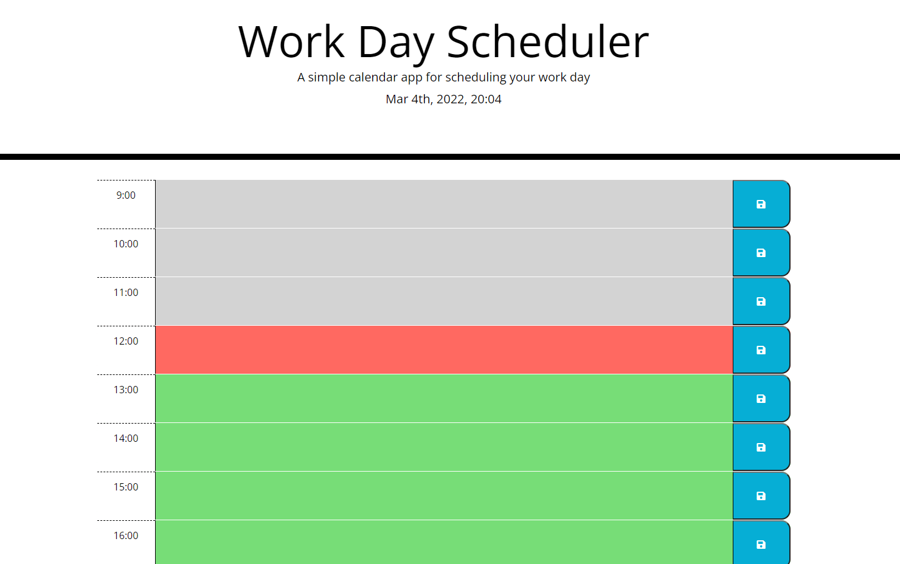

# Day-planner

## Table of content:

1. [Description](#description)
2. [Visuals](#visuals)
3. A [link](https://anastasiia-ciloci.github.io/Day-planner/) to a day planner

# Description

This is a simple calendar application that allows a user to save events for each working hour of the day. This app will run in the browser and feature dynamically updated HTML and CSS powered by jQuery.

The current day is displayed at the top of the calendar, each timeblock is color coded to indicate whether it is in the past, present, or future. The user can enter the event at the timeblock that is saved in local storage and after refreshing the page the saved events persist

## Visuals

# A link to the [Day Planner](https://anastasiia-ciloci.github.io/Day-planner/)

Or click [here](https://anastasiia-ciloci.github.io/Day-planner/) to open a day planner.
